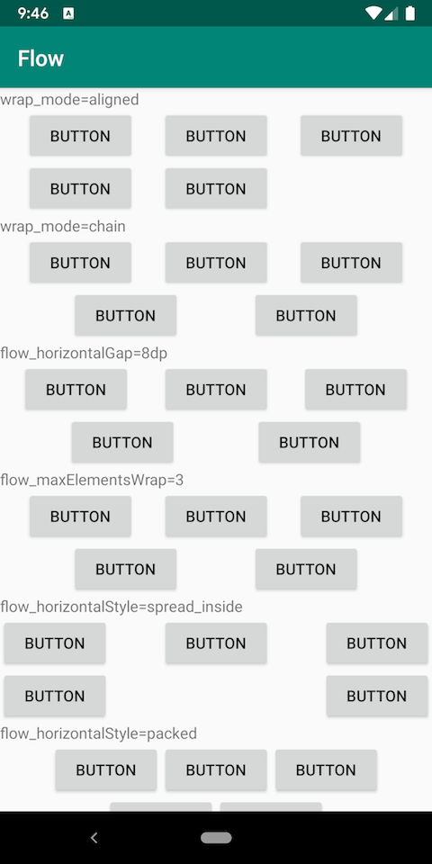
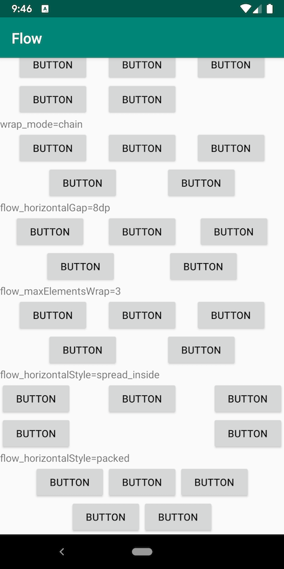

# ConstraintLayout Sample

* ConstraintLayout の機能を試すサンプルプロジェクト
* 2.0.0-beta1

## [WIP] virtual_layout

* Linear

を試すサンプル

## layer

* [Layer](https://developer.android.com/reference/android/support/constraint/helper/Layer)
  * View の集まりに対して見た目を操作する
  * transforms をサポート
    * rotation
    * scale
    * translation
* 複数の View をまとめて背景を指定する
* Group と違ってサイズがあるのでクリックイベントなども設定することができた

## decorators

* `ConstraintHelper` を利用して、カスタム Decorator を試すサンプル
  * `updatePostLayout` で指定された View に対して背景色を指定する Decorator
  * 最終目標は https://www.youtube.com/watch?v=ytZteMo4ETk&t=24m55s のアニメーション

### 疑問点

* 試した MetaballsDecorator だと、通常のカスタム View でも対応ができるが、どういった場合に、`ConstraintHelper` を使えばよいのか？
* `ConstraintHelper#onDraw` はどういった場合に利用する？
* https://www.youtube.com/watch?v=ytZteMo4ETk&t=24m55s のアニメーションはどう実装すればよいか？

## properties

* [ConstraintProperties](https://developer.android.com/reference/android/support/constraint/ConstraintProperties)
* `onCreate` などで、レイアウトが確定する前に `ConstraintProperties#apply` を呼び出せば、ConstraintLayout 内の一部の View のレイアウトを変更することができる
* `ConstraintSet` を変更時に受け取れる `postLayoutChange` でも変更可能

### 疑問点

* `ConstraintProperties` はどういった場合に利用するのか？

## optimizer

* optimizer による違いを確認するサンプル
* どのように最低化されるのかを調べるのかが不明

### 疑問点

* measure, layout の回数を調べる方法
  * Systrace は googlesamples/android-constraint-layout-performance を試したが記載通りの結果にならなかった

## flow

* [Flow](https://developer.android.com/reference/android/support/constraint/helper/Flow.html)
  * flat のレイアウト構成で Flexbox 的なレイアウトを実現する

### 詳細

* `flow_wrapMode`
  * `none`：デフォルト値。水平、垂直に並べるだけで、Flow のサイズを超えた場合でも何もしない
  * `chain`：水平、垂直に並べ、要素が Flow のサイズを超えた場合は折り返す。要素間には Chains が指定された状態となる
  * `aligned`：水平、垂直に並べ、要素が Flow のサイズを超えた場合は折り返す。 Style, Bias は効かない
* `flow_horizontalStyle`, `flow_VerticalStyle`：行、列の要素間の Chains の Style(デフォルトは spread)
* `flow_horizontalBias`, `flow_vertiacalBias`：行、列の要素の Bias(デフォルトは0.5)
* `flow_horizontalGap`, `flow_verticalGap`：要素間のマージン
* `flow_horizontalAlign`, `flow_verticalAlign`：要素間の配置指定。水平に並べる場合は、`flow_verticalAlign` のみ効く

### 疑問点

* `Flow` に指定する View のレイアウト制約は何を指定するべきなのか？
  * 何も指定しておかないと、IDE 上でエラーになる
