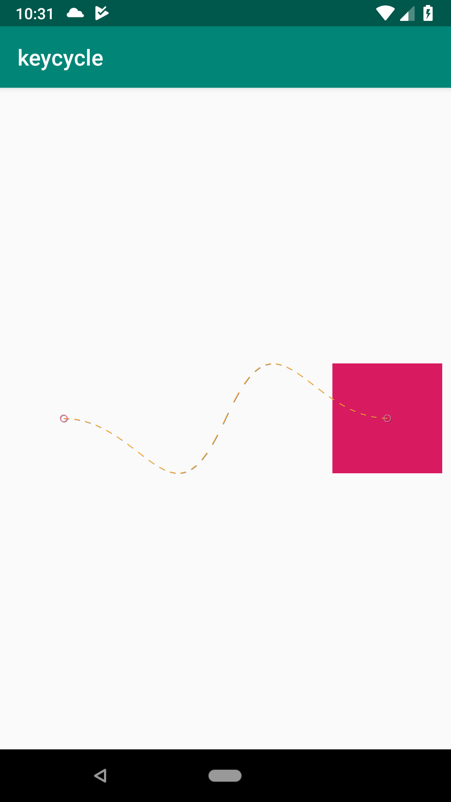
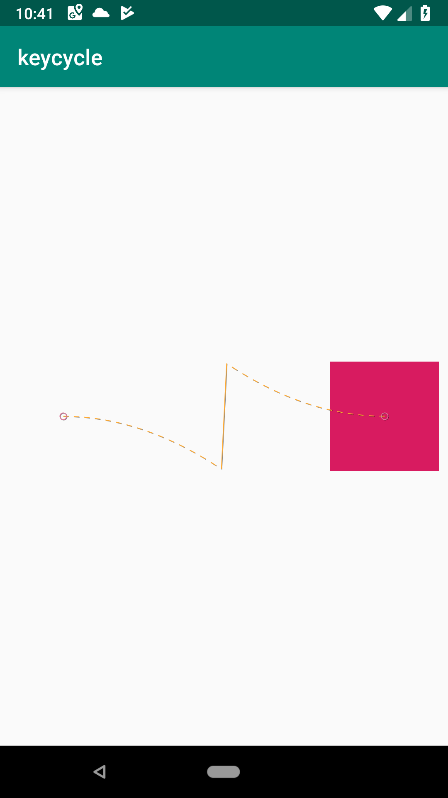
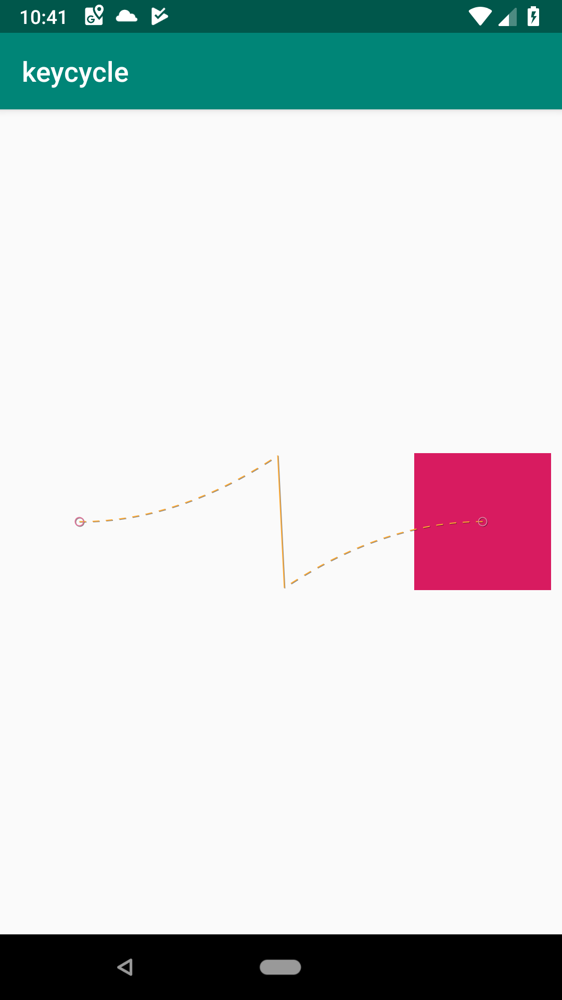
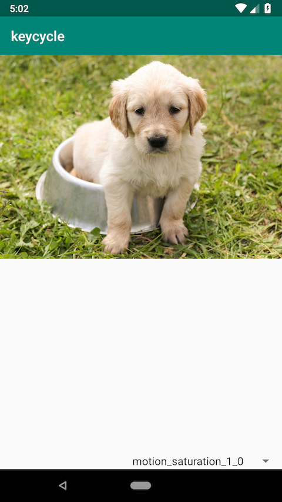
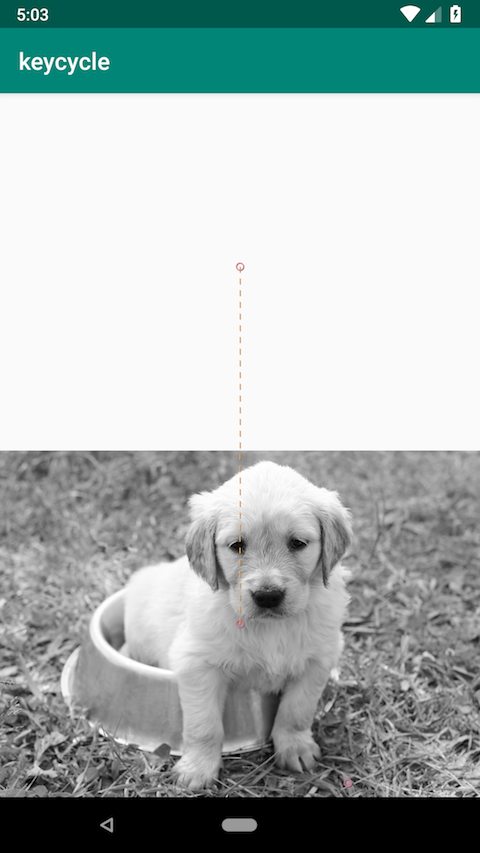
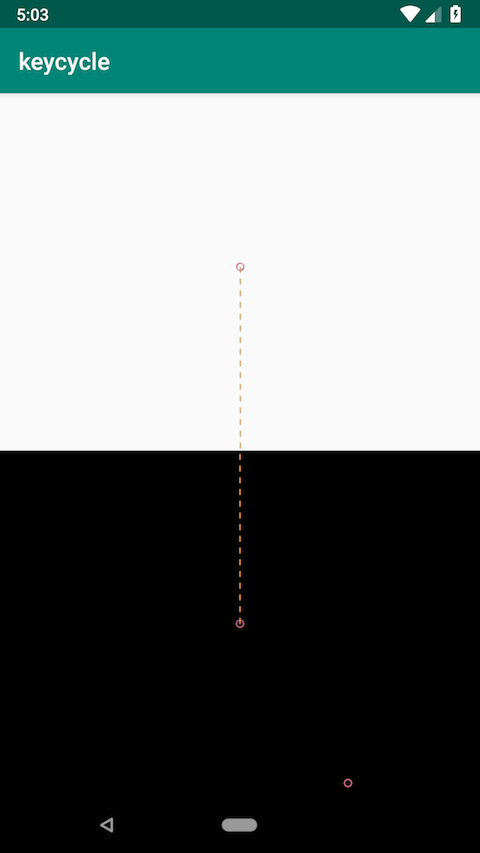
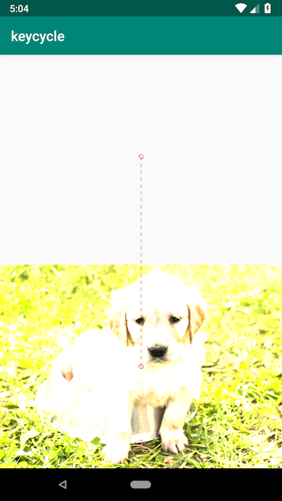
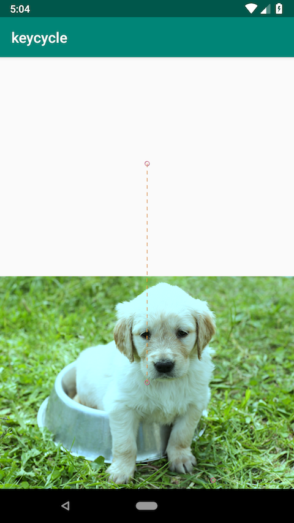
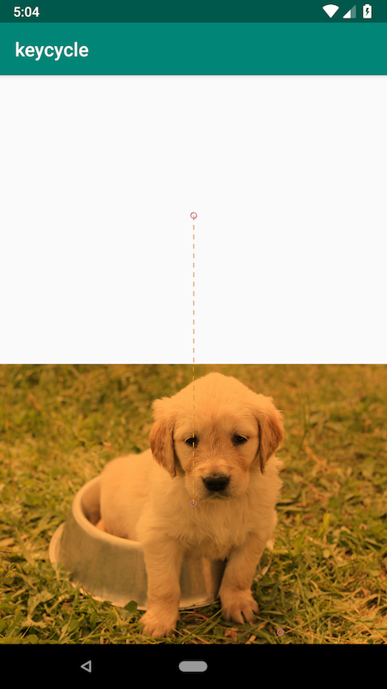

# README

## TODO

* KeyTrigger Collision
* Derived Constraints
* OnSwipe regions
* OnSwipe onTouchUp

## app

* https://github.com/googlesamples/android-ConstraintLayoutExamples と同じサンプルを1から実装

## keycycle

* `KeyCycle` の `waveShape` の違いを確認するサンプル

| waveShape | 結果 |
| - | - |
| sin |  |
| square |  |
| triangle |  |
| sawtooth |  |
| reverseSawtooth |  |
| cos |  |
| bounce |  |

## imagefilterview

* `ImageFilterView` のサンプル

| 概要 | 結果 |
| - | - |
| オリジナル |  |
| saturation 0 |  |
| saturation 2 |  |
| contrast 0 |  |
| contrast 2 |  |
| warmth 0.5 |  |
| warmth 2 |  |

## constraintsetintransition

* app と同じ動作
* `ConstraintSet` の定義位置を app とは異なり、`Transition` 以下に定義
* https://developer.android.com/reference/android/support/constraint/motion/MotionLayout#transition には、`ConstraintSet` は記載がないが、定義できるらしい

## keyframe

* `KeyPosition` の `type` の違いを確認するサンプル
* `parentRelative`
  * 親のレイアウトからの相対位置を指定する
    * ex. `percentY` を指定する場合
      * 0:親レイアウトの上端
      * 0.5:親レイアウトの中央
      * 1:親レイアウトの下端
* `pathRelative`
  * パスからの相対位置を指定する
    * ex. 垂直位置にセンタリングされた位置をアニメーションし、`percentY` を指定する場合
      * -1:親レイアウトの上端
      * 1:親レイアウトの下端
* `deltaRelative`
  * ex. 垂直位置にセンタリングされた位置を左から右へアニメーションし、`percentX` を指定する場合(y座標には移動しないので `percentY` は効果なし)
    * 0:開始位置
    * 1:終了位置
    * `framePosition` が 50 時点で、中央以外の座標にしておきたい場合に利用できる(interpolationがlinearでもアニメーション速度を一定でなくできる)

## [WIP] motionhelper

* `MotionHelper` の動作を試すサンプル
* 特定の `View` のみ Fade を適用するサンプル
  * `app:constraint_referenced_ids` を指定しているが、全ての `View` に対して alpha 値が変更されてしまう
* アニメーションの最後に他の `Constraint` に引きづられて、alpha 値が 1 に戻ってしまう

## arcmotion

* `pathMotionArc` を指定した場合の動作を試すサンプル

## easing

* `transitionEasing` を指定した場合の動作を試すサンプル
* `cubic` での指定でどう変わるのかが理解できていない

## keytriggercollision

* `KeyTrigger` の collision の動作を試すサンプル
  * View が FAB に触れると非表示になり、離れると表示される
* `motion_triggerOnCollision` で指定した View が該当の View に触れた場合に `onCross` などで指定したメソッドを呼び出す
  * `callOnClick` を指定すると `OnClickListener` に設定された処理が呼び出される
* FAB のように show/hide でアニメーションするような View で使うとよさそう

### 考察

`KeyTrigger` の `framePosition` である程度のケースは実装できるが、
他の View のアニメーションが完了したら、FAB を非表示にするのような場合は以下の定義では実現できない。

```
<KeyTrigger
  motion:framePosition="100"
  motion:motionTarget="@id/fab"
  motion:onPositiveCross="hide" />
```

最終的な View の位置が隣り合っていれば、Collision を利用することで、
他の View が最終的な位置に来たら(FAB に触れた)、アニメーションさせるという定義が実現できる。


### 概要

* `Animatable` を実装
* `ContainerHelper` を継承
* `onShow`, `onHide` を指定できる
* `setProgress`
  * `referencesId` が指定されている
    * `MotionHelper` が定義された同列の `View` に対して、`setProgress` を適用
  * `referencesId` が指定されていない
    * `MotionHelper` が定義された同列の `MotionHelper` 以外の `View` に対して、 `setProgress` を適用
* `MotionHelper` の `setProgress` が呼ばれるまで
  * `MotionLayout` に `MotionHelper` が定義し、`onShow` or `onHide` を指定する
    * `MotionLayout` で `onShow` or `onHide` が指定された、`MotionHelper` を管理する
  * `MotionLayout` の `setOnShow` or `setOnHide`　が呼ばれると、`onShow` or `onHide` が指定された `MotionHelper` 全てに対して、`setProgress` が呼ばれる

## diff

## 2.0.0-beta2

https://androidstudio.googleblog.com/2019/06/constraintlayout-200-beta-2.html

* `MotionScene.Transition.setEnable`
  * `allowsTransition` の代わり
* `MotionScene`, `Transition` のコンストラクタが追加
* `Transition` に ID が指定できるようになった
* `Transition` の有効・無効をどうてきに切り替えられるようになった
* アニメーション中の加速度にアクセスできるようになった
  * `MockView` をベースにした `MotionTelltales` で使われていてデバッグ用？
* `triggerReceiver`
  * 他の View の `KeyTrigger` を指定できるようになった
* bug fixes

## 2.0.0-beta1

https://androidstudio.googleblog.com/2019/05/constraintlayout-200-beta-1.html

* `motionStagger`
  * Transition に複数の motionStagger を指定できるようになった
* `onTouchUp`
  * `autoComplete` が `onToutchUp` に変わった
* `visibilityMode`
  * visibility が操作できるようになり、MotionLayout での設定が不要になる
* `TransitionListener` の interface が変わった
* attribute のリネーム
  * app -> android

## 2.0.0-alpha5

https://androidstudio.googleblog.com/2019/04/constraintlayout-200-alpha-5.html

* `autoTransition`
  * start, end に到達したら自動的に元に戻るアニメーションを定義できる
* `deriveConstraintsFrom`
  * 別の `ConstraintSet` を使い、差分の Constraint だけ定義することでコード量を減らすことができる
* `touchRegionId`
  * スワイプ可能な領域を指定できる？
* `layout_constraintTag, motionTarget`
* `OnSwipe`：`autoComplete="false"`
  * 特定の方向のみアニメーションするカスタムスライダーを実装できる
* `OnClick`：target を指定していなかったら `MotionLayout` がターゲットになる

## 2.0.0-alpha4

https://androidstudio.googleblog.com/2019/04/constraintlayout-200-alpha-4.html

* Barrier, Helpers をサポート
* `OnClick` のアクションが追加
  * toggle や start, end へのアニメーションあり・なしでの切り替えを指定が可能
* `customPixelDimentions` のサポート
  * `textSize` の変更などを `CustomAttribute` で定義できるようになった
* `ImageFilterView` のオーバレイのサポート
  * クロスフェードするかどうかを切り替えられるように
* KeyTrigger collision のサポート
  * 指定した View が衝突したタイミングでアニメーションを開始することができる？
* attribute のリネーム

## 2.0.0-alpha3

https://androidstudio.googleblog.com/2018/12/constraintlayout-200-alpha-3.html

* xml で ConstraintSets の指定が可能になった
  * レイアウトとは別のファイルに `Constraint` を定義できるようになった
* `KeyTimeCycle`：時間で動作するアニメーションを定義できる
* `KeyPosition`：`percentWidth`, `percentHeight` が追加
* `KeyTrigger`：現在のアニメーションの進行状況に依存する keyframe を定義できる
* interpolator のカスタム
* タッチ操作で複数の状態をシームレスに変化させることが可能になった
* MotionScene ごとに複数の `OnClick` が指定できるようになった
  * `motion:mode` が `motion:clickAction` にリネーム
* `InageFilterButton` の追加
* `TransitionListener` の追加

## 2.0.0-alpha2

https://androidstudio.googleblog.com/2018/08/constraintlayout-200-alpha-2.html

* 色の変化が可能になった
* Arc Motion の追加
* View に紐づけなくても `OnSwipe` が使えるようになった
* `TimeCycle` の追加
* `motion:keyPositionType` にリネーム

### 2.0.0-alpha1

https://androidstudio.googleblog.com/2018/06/constraintlayout-200-alpha-1.html

* `MotionLayout` の追加
